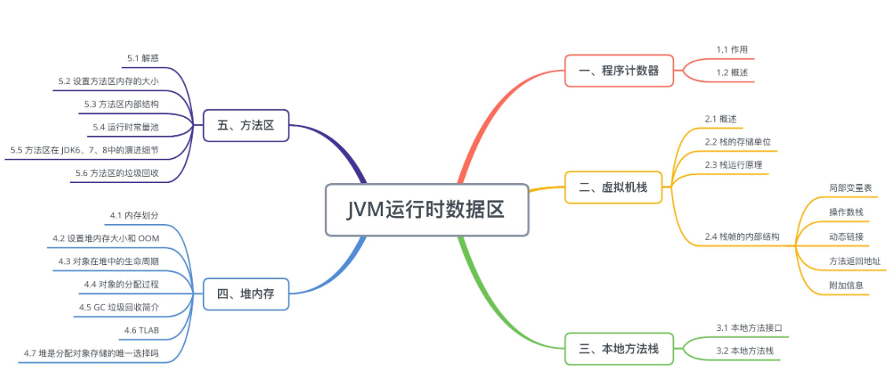

# JAVA 虚拟机

## JAVA类加载
* JAVA 类加载过程：加载、验证、准备、解析、初始化
* 加载： jvm虚拟机根据类的全限定类名加载javac编译的字节码文件
* 验证： 对加载的字节码文件进行校验
* 准备： 对类、方法等准备相应的内存等资源
* 解析： JAVA对字节码文件进行解析
* 初始化： 对类、静态变量进行初始化

* JAVA 虚拟机的双亲委派机制：JAVA类加载过程是基于类加载器完成的，默认有Boostrap类加载器、ExtensionClassLoader、Application类加载器，类加载的过程是逐级委托，然后逐级加载。我们也可以自定类类加载器，通过继承ClassLoader是抽象类来实现自定义类加载器。
* JAVA 虚拟机双亲委派机制作用: 保证JAVA虚拟机的不会出现相同的字节码文件，保证JAVA程序的稳定性

## JVM内存模型
* JMM 。 JAVA的内存分为主存、线程内存，当线程A操作主存数据时，首先会把主存数据的副本copy到线程内存中，然后线程内存修改copy的副本数据，刷新的主存。其他线程感到到主存数据的变化，更新自己线程内存数据。
* 保证JAVA线程安全： 可见性、原子性、有序性内存模型是JAVA为了规范各各线程之间对共享变量操作的一个虚拟概念
* 

## 运行时数据区
> 运行时内存区

* 线程私有：程序计算器、本地方法栈、虚拟机栈
* 线程共享：方法区（JDK1.8 元空间）、堆空间

* 程序计数器：一块较小的内存空间，可以看作是当前线程所执行的字节码的行号指示器。存储指向下一条指令的地址，即将要执行的指令代码。由执行引擎读取下一条指令。
* 本地方法栈： 方法调用时，会创建一个栈帧，每个栈帧存放局部变量、方法出口、操作数栈、动态
* 虚拟机栈：
* 方法区：
* 堆空间：

>
## 垃圾回收机制

* 垃圾回收算法：引用计数法、可达性分析发
> 
> 
* 标记清除
* 
* 标记复制
* 
* 标记整理
* 
* 分代收集

## JVM优化
> XMS
> XMX
>
> 
> 

