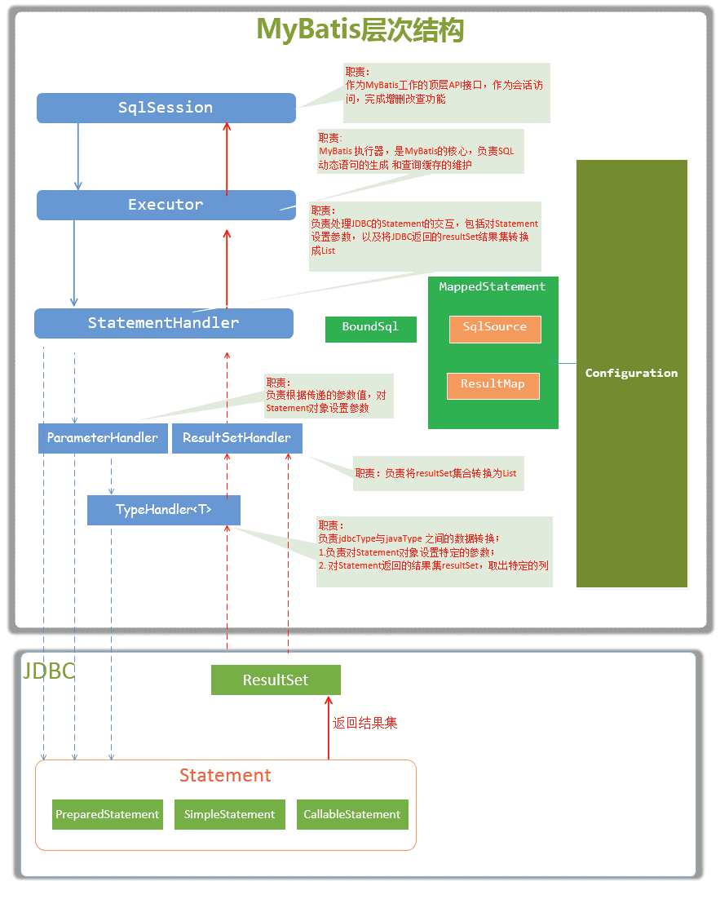
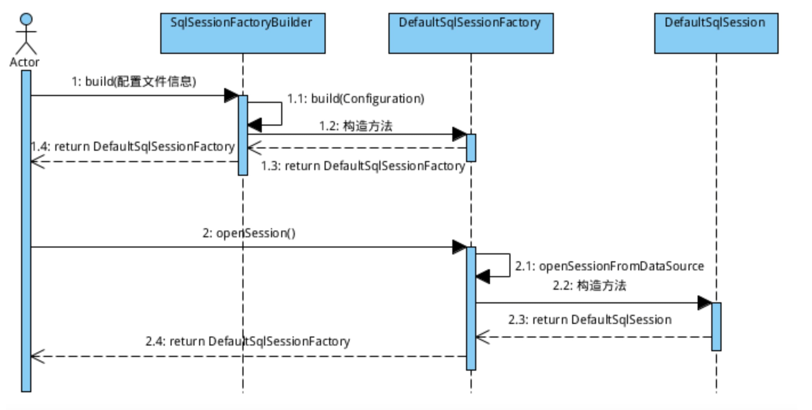

# Mybatis 面试题 

# Mybatis 流程

* SqlSessionFactoryBuilder  根据Configuration 创建 SqlSession对象

* SqlSession
SqlSession 代表一次数据库的连接，Mybatis通过工厂模式创建SqlSessionFatory对象

* Executor

* StatementHandler

* ResultSetHandler

* ParameterHandler

# MyBatis 分页插件

# MyBatis 一级缓存 、二级缓存

