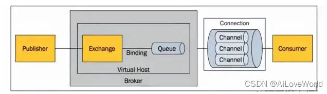

# RabbitMQ  全称消息队列 ，多用于消息的传输中保存消息的容器
* 远程MQ调用
* 分布式系统MQ调用

# MQ 优缺点

# RabbitMQ  作用
* 削峰： 并发量巨大时，系统无法处理请求时，将请求存放到MQ处理，待并发量小的时候处理，  -适用场景：不需要即使相应的业务
* 解耦： 各个模块之间的调用，减少模块间的耦合
* 异步： MQ的调用属于异步调用，相比多线程比较，MQ有一定的优势，可以更好的处理调用的结构，

# 为什么选择RabbitMQ 
* rabbitMQ 的可靠性比较高，能保证数据百分之百不丢失
* 成熟的管理页面
* 并发能力强，延迟小

# MQ 实现的主流方向：AMQP JMS

# AMQP 高级消息队列协议

# RabbitMQ 组件
>Broker ：一个RabbitMQ实例就是一个Broker
>Virtual Host ：虚拟主机。相当于MySQL的DataBase，一个Broker上可以存在多个vhost，vhost之间相互隔离。每个vhost都拥有自己的队列、交换机、绑定和权限机制。vhost必须在连接时指定，默认的vhost是/。
>Exchange ：交换机，用来接收生产者发送的消息并将这些消息路由给服务器中的队列。
>Queue ：消息队列，用来保存消息直到发送给消费者。它是消息的容器。一个消息可投入一个或多个队列。
>Banding ：绑定关系，用于消息队列和交换机之间的关联。通过路由键（Routing Key）将交换机和消息队列关联起来。
>Channel ：管道，一条双向数据流通道。不管是发布消息、订阅队列还是接收消息，这些动作都是通过管道完成。因为对于操作系统来说，建立和销毁TCP都是非常昂贵的开销，所以引入了管道的概念，以复用一条TCP连接。
>Connection ：生产者/消费者 与broker之间的TCP连接。
>Publisher ：消息的生产者。
>Consumer ：消息的消费者。
>Message ：消息，它是由消息头和消息体组成。消息头则包括Routing-Key、Priority（优先级）
> 生产者  -exchange -banding  -queue  - 消费者
> broker   virtual host    exchange  queue  banding  connection   channel   comsumer
>

# Exchange 方式
> Direct：消息中的 Routing Key 如果和 Binding 中的 Routing Key 完全一致， Exchange 就会将消息分发到对应的队列中。
>    Routing  
> Fanout：每个发到 Fanout 类型交换机的消息都会分发到所有绑定的队列上去。Fanout交换机没有 Routing Key 。它在三种类型的交换机中转发消息是最快的。广播
> 
> Topic：Topic交换机通过模式匹配分配消息，将 Routing Key 和某个模式进行匹配。它只能识别两个通配符：“#“和”*”。### 匹配0个或多个单词
> 

# 幂等校验
* MQ幂等校验两种方式：1.redis分布式锁防止mq重复消费   2：维护mq记录表，校验消息是否被消费   3：业务维度考虑防重设计

* RabbitMQ 工作模式
> simple模式（即最简单的收发模式）
> simple 
> 
> work工作模式(资源的竞争)
> 
> 
> publish/subscribe发布订阅(共享资源)
> 
> 
> routing路由模式
> 
> 
> topic 主题模式(路由模式的一种)
>
> 
>

* RabbitMQ 怎么保证消息不丢失
>生产者到RabbitMQ：事务机制和Confirm机制，注意：事务机制和 Confirm 机制是互斥的，两者不能共存，会导致 RabbitMQ 报错。
channel.txSelect  用于将当前的信道设置成事务模式。
channel . txCommit 用于提交事务 。
channel . txRollback 用于事务回滚,如果在事务提交执行之前由于 RabbitMQ 异常崩溃或者其他原因抛出异常,通过txRollback来回滚。
> 
>RabbitMQ自身：持久化、集群、普通模式、镜像模式。

>RabbitMQ到消费者：basicAck机制、死信队列、消息补偿机制。

* RabbitMq 保证顺序消费
> 如果业务简单MQ消息堆积也小，那就可以使用一个Queue和一个消费者来确保消息的顺序消费，这样依赖只要消息是按顺序生产投入同一个Queue中的的，就可以按投入的顺序被同一个消费者消费
> 业务上处理，baseAic机制 、死信队列 、补偿机制
* RabbitMQ 防重
> Redis分布式锁，通过数据防重
> MQ日志表 
> 业务层防重复校验
* RabbitMQ 方式消息丢失

延迟消息的实现

https://juejin.cn/post/7179077170470322236

* RabbitMQ   最终一致性 
* 

rabbitMQ 持久化 
队列持久化   channel    durable =true  
消息持久化    deliverMode    2 

activeMq  rabbitMQ  rocketMQ   kafra

activeMq  

rabbitMQ

rocketMQ   高可用 集群   可靠   rabbitMQ   erlang  语言 是开源头   rocketMQ  基于 java 不开源头   知晓  rabbitMQ    x

