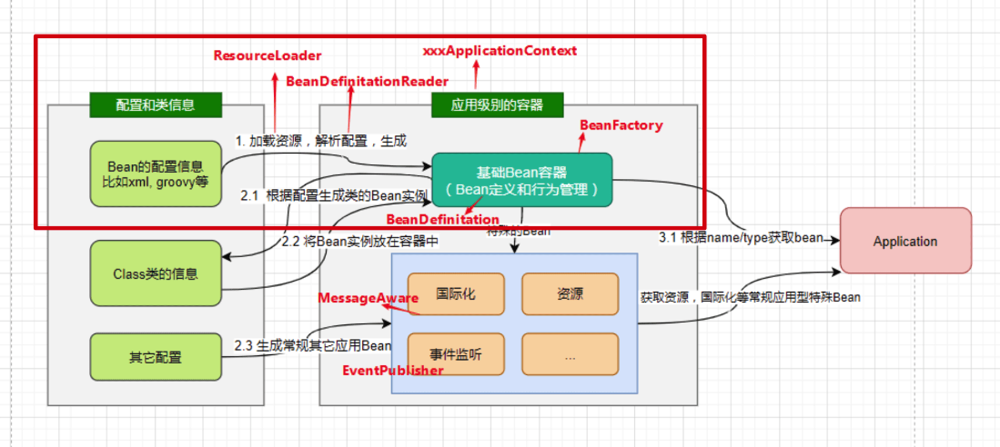
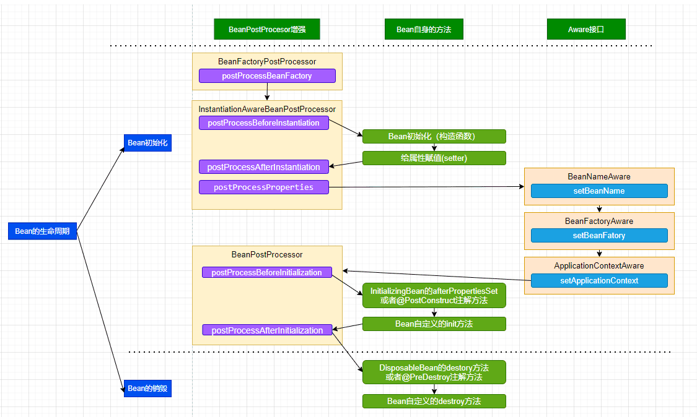

# Spring

* IOC 初始化

* AOP
* BEAN 生命周期

* Bean初始化
* Bean 属性赋值
* Aware相关接口
* BeanPostProcess前置处理器
* init-method
* BeanPostProcess后置处理器
* destroy-method

> BeanFactoryPostProcess.postProcessBeanFactory
> 
* 注解

* Spring 隔离级别
> default 与数据库保持一直
> 读未提交：读到其他事务未提交的数据
> 读已提交：读到其他事务已提交的数据
> 不可重复读： 
> 串行化

* Spring 传播属性
> required
> required_new
> support
> no_support  
> never   // 只能已非事务运行
> 
> 

* AOP 动态代理的区别
* 